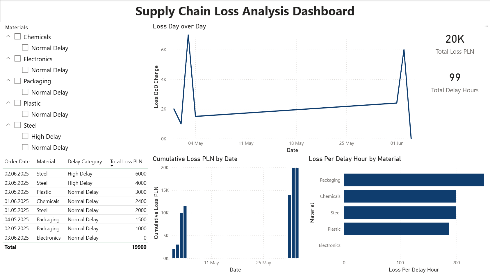

# End-to-End Project: Supply Chain Loss Analysis (SQL & Power BI)

This project demonstrates how I used **SQL** to perform in-depth financial analysis and **Power BI** to visualize operational insights regarding losses caused by delivery delays in a supply chain process. The dataset includes synthetic daily records with materials, order values, delay hours, and financial losses.

---

## Visualization (Power BI Dashboard)

The final step was translating SQL logic into an interactive dashboard, focusing on actionable KPIs for management.

| Key Visualization | DAX Logic (SQL-to-BI) | Insight |
| :--- | :--- | :--- |
| **Loss Per Delay Hour** | DAX KPI Calculation | Ranks materials by operational inefficiency (e.g., Packaging is the highest risk). |
| **Loss Day over Day** | DAX Time Intelligence (`DATEADD`) | Highlights volatility and spikes in loss events (analogue to SQL `LAG()`). |
| **Cumulative Loss PLN** | DAX Running Total (`FILTER(ALL())`) | Tracks overall financial liability over time. |

---

## Tools and Skills

* **Data Preparation:** PostgreSQL
* **Visualization & Analytics:** Power BI
* **SQL Window Functions:** `SUM() OVER`, `RANK() OVER`, `LAG()`
* **Data Cleaning:** `COALESCE`
* **Analytical Logic:** DAX (Time Intelligence, Custom KPIs)

---

## Project Overview

### 1. Data Cleaning (CTE)

I used a CTE to handle data preparation. I chose this method over creating a new permanent table to keep the entire project logic from cleaning to analysis contained within a single, easy to read script. The CTE was used to:

* replace missing financial loss values with `0`,
* keep the dataset consistent for analysis,
* add a simple delay category.

### 2. Running Total of Losses

Using `SUM() OVER (ORDER BY order_date)` I calculated the cumulative financial loss over time to see how losses grow day by day.

### 3. Top Loss Days per Month

With `RANK()` and `PARTITION BY month`, I identified the highest loss days within each month to highlight anomalies and critical dates.

### 4. Day-over-Day Loss Change

Using `LAG()`, I compared each day’s loss to the previous day to detect sudden spikes or improvements in operational performance.

### 5. KPI: Loss per Delay Hour

I calculated a simple KPI total financial loss divided by total delay hours for each material and ranked materials by inefficiency.

---

## Result

The project successfully demonstrates my ability to execute the complete analytical workflow:

* **prepare and clean data** in a database environment,
* **work with advanced SQL window functions**,
* **build complex analytical KPIs using DAX** in Power BI,
* **visualize insights** for business stakeholders, and
* **extract actionable conclusions** from operational datasets.

The full SQL script and the Power BI `.pbix` file are included in the repository.
